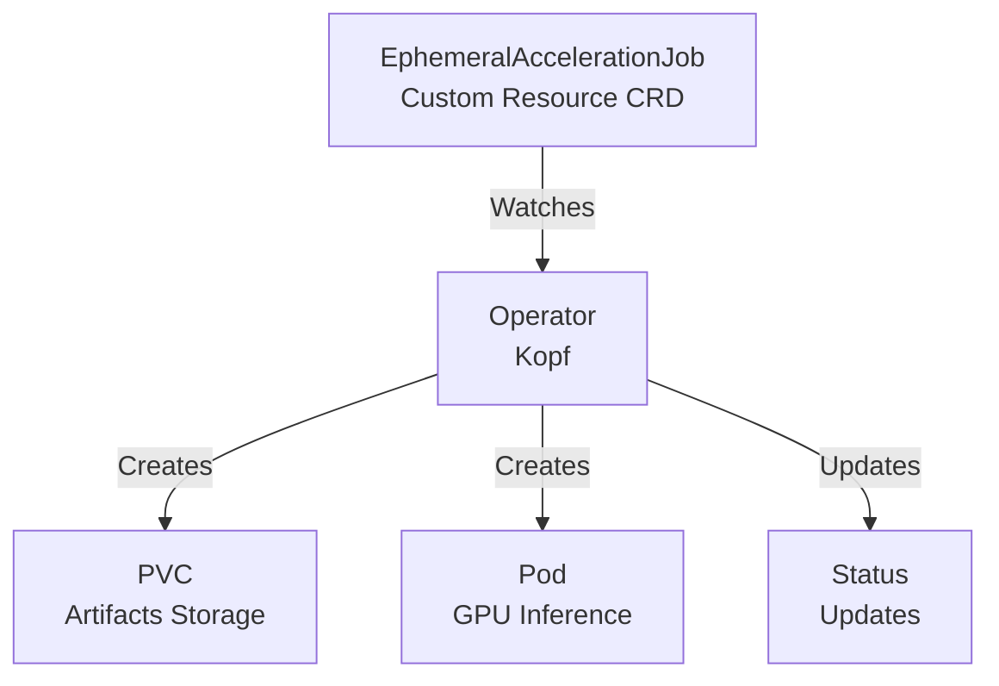
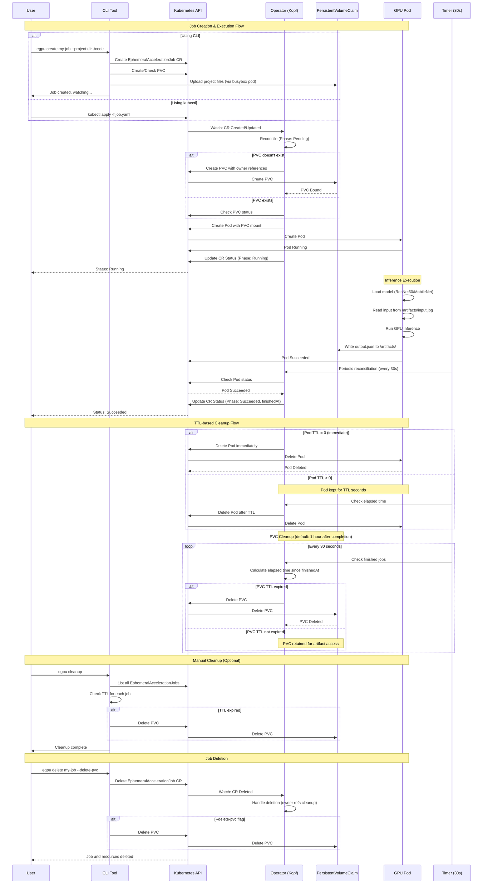

# Ephemeral GPU Image Inference Operator

A Kubernetes operator that manages ephemeral GPU jobs for image inference tasks.

## Overview

This operator allows you to run GPU-backed image inference jobs that:
- Automatically create and manage GPU pods
- Mount persistent storage for input images and output artifacts
- Clean up pods automatically after completion (ephemeral)
- Automatically clean up PVCs based on configurable TTL
- Track job status and provide artifact paths
- Provide intuitive CLI for job management

## Architecture



## Sequence Diagram

The following diagram shows the complete lifecycle of an EphemeralAccelerationJob:



## Prerequisites

### Required
- **Kubernetes cluster** (k3s, kind, or cloud) with:
  - NVIDIA GPU support
  - NVIDIA Container Toolkit installed
  - NVIDIA device plugin running
- **kubectl** configured with cluster access
- **Docker** for building images
- **Helm 3** for operator installation
- **Python 3.12+** (for local development)

### Verify Prerequisites

```bash
# Check cluster access
kubectl cluster-info

# Check GPU nodes
kubectl get nodes -o jsonpath='{range .items[*]}{.metadata.name}{"\t"}{.status.capacity.nvidia\.com/gpu}{"\n"}{end}'

# Check NVIDIA device plugin
kubectl get daemonset -n kube-system | grep nvidia

# Check storage class (for k3s, should be "local-path")
kubectl get storageclass
```

## CLI Tool

The project includes a CLI tool that makes EphemeralAccelerationJobs feel like native Kubernetes resources. The CLI handles PVC creation, file uploads, and resource management automatically.

### Installation

```bash
# Install CLI
pip install -e .
# Or: make cli
```

### Quick Examples

```bash
# Create a job with project directory (handles PVC creation and file upload)
egpu create my-job --project-dir ./my-code --input-path /artifacts/image.jpg

# Create with custom PVC TTL (24 hours retention)
egpu create training-job \
  --project-dir ./ml-project \
  --input-path /artifacts/input.jpg \
  --pvc-ttl 86400

# Watch job status
egpu watch my-job

# Get job details
egpu get my-job

# List all jobs
egpu list

# Clean up PVCs for finished jobs (based on TTL)
egpu cleanup

# Delete job and PVC
egpu delete my-job --delete-pvc
```

### Key Features

- **Automatic PVC Management**: Creates and manages PVCs automatically
- **Project Upload**: Easily upload entire project directories to PVCs
- **TTL-based Cleanup**: Automatic PVC cleanup based on configurable TTL
- **Native Feel**: Works like `kubectl get`, `kubectl create`, etc.

See [src/cli/README.md](src/cli/README.md) and [CLI-USAGE.md](CLI-USAGE.md) for complete CLI documentation.

## Quick Start

### 1. Build Images

```bash
make build
```

This builds:
- `ephemeral-gpu-operator:latest` - The operator container
- `gpu-job-inference:latest` - The inference job container

### 2. Load Images (for local clusters)

If using k3s or kind, load images into the cluster:

```bash
make load
```

For k3s, you may need to import images manually:
```bash
sudo k3s ctr images import < operator.tar
sudo k3s ctr images import < job.tar
```

### 3. Install Operator

```bash
make install
```

This installs the operator via Helm, including:
- CRD definition
- RBAC (ServiceAccount, ClusterRole, ClusterRoleBinding)
- Operator Deployment

### 4. Run Example Job

**Option A: Using CLI (Recommended)**

```bash
# Create job with project directory (automatically handles PVC and file upload)
egpu create sample-inference \
  --project-dir ./examples \
  --input-path /artifacts/sample.jpg \
  --model resnet50

# Watch job
egpu watch sample-inference
```

**Option B: Using kubectl**

```bash
# Prepare input image first (see "Running a Job" section below)
# Then apply the example
kubectl apply -f examples/ephemeralaccelerationjob.yaml

# Watch status
kubectl get ephemeralaccelerationjob sample-inference -w
```

**Option C: Using Makefile**

```bash
make example
```

## Running a Job

### Using CLI (Recommended - Simplest Method)

The CLI handles everything automatically:

```bash
# Create job with project directory
# - Automatically creates PVC
# - Uploads project directory to PVC
# - Creates EphemeralAccelerationJob
egpu create my-inference \
  --project-dir ./my-ml-project \
  --input-path /artifacts/input.jpg \
  --model resnet50 \
  --pvc-ttl 3600  # Keep PVC for 1 hour (default)

# Watch job progress
egpu watch my-inference

# Get final status
egpu get my-inference

# Retrieve artifacts (see below)
```

### Using kubectl (Manual Method)

**Step 1: Copy Input Image to PVC**

Before creating the EphemeralAccelerationJob, you need to copy your input image into the PVC. The operator will create a PVC named `artifacts-<job-name>`.

```bash
# Apply EphemeralAccelerationJob (operator creates PVC)
kubectl apply -f examples/ephemeralaccelerationjob.yaml

# Wait for PVC to be created
kubectl wait --for=condition=Bound pvc/artifacts-sample-inference --timeout=60s

# Copy image using debug pod
kubectl run copy-pod --rm -i --tty --image=busybox --restart=Never --overrides='
{
  "spec": {
    "volumes": [{
      "name": "artifacts",
      "persistentVolumeClaim": {"claimName": "artifacts-sample-inference"}
    }],
    "containers": [{
      "name": "copy",
      "image": "busybox",
      "command": ["sh"],
      "volumeMounts": [{"name": "artifacts", "mountPath": "/mnt"}]
    }]
  }
}' -- sh -c "wget -O /mnt/input.jpg https://example.com/image.jpg"
```

**Step 2: Watch Status**

```bash
# Watch EphemeralAccelerationJob
kubectl get ephemeralaccelerationjobs -w

# Describe for details
kubectl describe ephemeralaccelerationjob sample-inference

# Watch pod
kubectl get pods -w

# Check logs
kubectl logs -l app=gpu-job --tail=50
```

**Step 3: Retrieve Artifacts**

After the job completes, retrieve the output:

```bash
# Using CLI (easiest)
egpu get sample-inference  # Shows artifact path

# Or create debug pod to access PVC
kubectl run debug-pod --rm -i --tty --image=busybox --restart=Never --overrides='
{
  "spec": {
    "volumes": [{
      "name": "artifacts",
      "persistentVolumeClaim": {"claimName": "artifacts-sample-inference"}
    }],
    "containers": [{
      "name": "debug",
      "image": "busybox",
      "command": ["sh"],
      "volumeMounts": [{"name": "artifacts", "mountPath": "/mnt"}]
    }]
  }
}' -- sh

# Inside pod, check artifacts
cat /mnt/output.json
ls -la /mnt/
```

## EphemeralAccelerationJob Resource Specification

```yaml
apiVersion: gpu.yourdomain.io/v1alpha1
kind: EphemeralAccelerationJob
metadata:
  name: my-inference-job
  namespace: default
spec:
  model: resnet50                    # resnet50 or mobilenet_v3_small
  input:
    type: image
    path: /artifacts/input.jpg        # Path inside PVC
  output:
    path: /artifacts/output.json      # Output JSON path
  resources:
    gpu: 1                            # Number of GPUs
  ttlSecondsAfterFinished: 0         # Pod TTL: 0 = delete immediately, >0 = keep for N seconds
  pvcTTLSecondsAfterFinished: 3600   # PVC TTL: 0 = delete immediately, default: 3600 (1 hour)
  storageClass: local-path            # PVC storage class
  pvcSize: 1Gi                        # PVC size
  image: gpu-job-inference:latest     # Job container image
```

### TTL Configuration

The operator supports separate TTLs for pods and PVCs:

- **`ttlSecondsAfterFinished`**: Controls when the pod is deleted
  - `0` = Delete pod immediately after completion (default)
  - `> 0` = Keep pod for N seconds after completion
  
- **`pvcTTLSecondsAfterFinished`**: Controls when the PVC is deleted
  - `0` = Delete PVC immediately after job completion
  - `3600` = Keep PVC for 1 hour (default) - allows artifact retrieval
  - `> 0` = Keep PVC for N seconds after completion

**Best Practice**: Use separate TTLs to balance cost (delete pods quickly) with usability (keep PVCs for artifact retrieval). See [PVC-LIFECYCLE.md](PVC-LIFECYCLE.md) for details.

### Status Fields

```yaml
status:
  phase: Succeeded                    # Pending | Running | Succeeded | Failed
  message: "Job completed successfully"
  startedAt: "2024-01-01T12:00:00Z"
  finishedAt: "2024-01-01T12:01:30Z"
  podName: "ephemeralaccelerationjob-my-inference-job"
  artifactPath: "/artifacts/output.json"
```

## Output Format

The inference job writes a JSON file with:

```json
{
  "model": "resnet50",
  "top5": [
    {"label": "class_285", "probability": 0.8234},
    {"label": "class_123", "probability": 0.1234},
    ...
  ],
  "elapsed_ms": 45.23,
  "device": "cuda",
  "timestamp": "2024-01-01T12:01:30Z"
}
```

## Makefile Commands

```bash
make build          # Build operator and job images
make load           # Load images into local cluster
make install        # Install operator via Helm
make cli            # Install CLI tool
make example        # Apply example EphemeralAccelerationJob and watch
make logs           # Show operator and job logs
make status         # Show EphemeralAccelerationJob status
make artifacts      # Instructions for accessing artifacts
make clean          # Uninstall operator and clean up
```

## Development

### Local Development

```bash
# Install dependencies
pip install -e .

# Run operator locally (requires kubeconfig)
python -m operator.main

# In another terminal, apply EphemeralAccelerationJob
kubectl apply -f examples/ephemeralaccelerationjob.yaml
```

### Project Structure

```
.
├── src/
│   ├── operator/          # Operator code
│   │   ├── main.py        # Kopf entrypoint
│   │   ├── crd.py         # CRD constants
│   │   ├── k8s.py         # K8s client helpers
│   │   ├── reconcile.py   # Reconciliation logic
│   │   └── templates.py   # Resource templates
│   ├── job_image_infer/  # Job container code
│   │   └── run_infer.py   # Inference script
│   └── cli/               # CLI tool
│       └── main.py        # CLI implementation
├── docker/                # Dockerfiles
├── charts/                # Helm chart
├── examples/              # Example resources
└── scripts/               # Utility scripts
```

## Troubleshooting

### Operator not starting

```bash
# Check operator logs
kubectl logs -l app=ephemeral-gpu-image-inference-operator

# Check deployment status
kubectl describe deployment -l app=ephemeral-gpu-image-inference-operator
```

### Pod not scheduling

```bash
# Check GPU availability
kubectl describe node <node-name> | grep nvidia.com/gpu

# Check pod events
kubectl describe pod ephemeralaccelerationjob-<job-name>

# Check if GPU device plugin is running
kubectl get daemonset -n kube-system | grep nvidia
```

### Job failing

```bash
# Check pod logs
kubectl logs ephemeralaccelerationjob-<job-name>

# Check EphemeralAccelerationJob status
kubectl describe ephemeralaccelerationjob <job-name>

# Verify input image exists in PVC
# (use debug pod as shown in "Retrieve Artifacts" section)
```

### PVC issues

```bash
# Check PVC status
kubectl get pvc artifacts-<job-name>

# Check storage class
kubectl get storageclass

# For k3s, ensure local-path provisioner is installed
```

## PVC Lifecycle Management

The operator automatically manages PVC lifecycle based on TTL:

- **Pod TTL**: Pods are deleted based on `ttlSecondsAfterFinished` (default: 0 = immediate)
- **PVC TTL**: PVCs are deleted based on `pvcTTLSecondsAfterFinished` (default: 3600 = 1 hour)
- **Automatic Cleanup**: Operator timer checks and deletes PVCs when TTL expires
- **Owner References**: PVCs have owner references for cascade deletion

**What happens when a job expires:**
1. Pod is deleted immediately (if `ttlSecondsAfterFinished: 0`)
2. PVC is kept for artifact retrieval (default: 1 hour)
3. Operator automatically deletes PVC after PVC TTL expires
4. No manual cleanup required

See [PVC-LIFECYCLE.md](PVC-LIFECYCLE.md) for detailed best practices and configuration options.

## Cleanup

### Using CLI

```bash
# Delete job and PVC
egpu delete sample-inference --delete-pvc

# Clean up all PVCs where TTL has expired
egpu cleanup

# Clean up in specific namespace
egpu cleanup --namespace gpu-demo
```

### Using kubectl

```bash
# Remove example job
kubectl delete ephemeralaccelerationjob sample-inference

# PVC will be automatically deleted after TTL expires
# Or delete manually:
kubectl delete pvc artifacts-sample-inference
```

### Uninstall Operator

```bash
make clean

# Or manually
helm uninstall gpu-operator
kubectl delete crd ephemeralaccelerationjobs.gpu.yourdomain.io
```

## Key Features

### Operator Features
- ✅ **Automatic Resource Management**: Creates and manages PVCs and Pods
- ✅ **TTL-based Cleanup**: Separate TTLs for pods and PVCs
- ✅ **Status Tracking**: Real-time job status with artifact paths
- ✅ **Error Handling**: Graceful error handling and retry logic
- ✅ **Reconciliation**: Timer-based reconciliation ensures desired state

### CLI Features
- ✅ **Intuitive Interface**: Works like native Kubernetes commands
- ✅ **Automatic PVC Management**: Creates and manages PVCs automatically
- ✅ **Project Upload**: Easily upload project directories to PVCs
- ✅ **TTL-based Cleanup**: Automatic PVC cleanup based on TTL
- ✅ **Status Monitoring**: Real-time job status watching

## Documentation

- [CLI Usage Guide](CLI-USAGE.md) - Complete CLI documentation
- [CLI README](src/cli/README.md) - CLI command reference
- [PVC Lifecycle Management](PVC-LIFECYCLE.md) - Best practices for PVC TTL
- [Quick Start Guide](QUICKSTART.md) - Step-by-step demo walkthrough

## References

- [Kopf Documentation](https://kopf.readthedocs.io/)
- [Kubernetes Python Client](https://github.com/kubernetes-client/python)
- [PyTorch Documentation](https://pytorch.org/docs/)

## License

This is a demo project for educational purposes.
