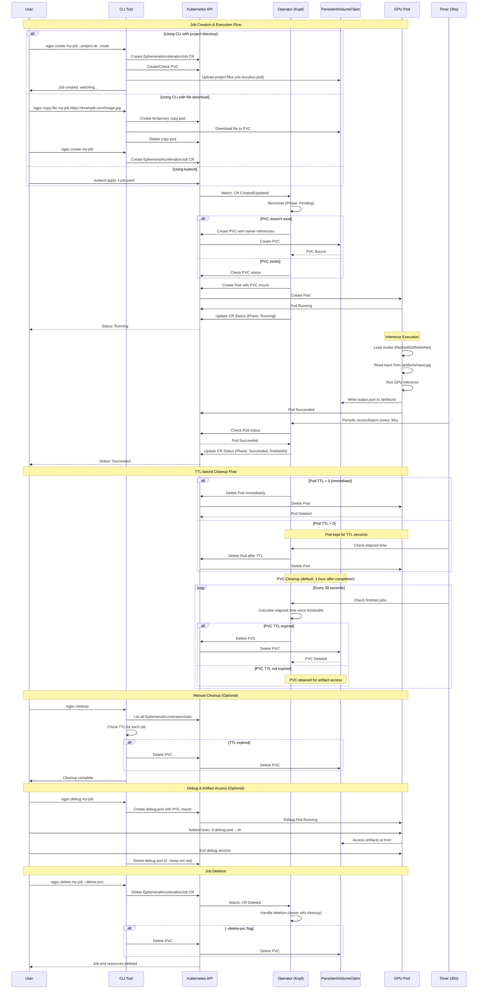

# Sequence Diagram

The following diagram shows the complete lifecycle of an EphemeralAccelerationJob:

```mermaid
sequenceDiagram
    participant User
    participant CLI as CLI Tool
    participant K8sAPI as Kubernetes API
    participant Operator as Operator (Kopf)
    participant PVC as PersistentVolumeClaim
    participant Pod as GPU Pod
    participant Timer as Timer (30s)

    Note over User,Pod: Job Creation & Execution Flow

    alt Using CLI with project directory
        User->>CLI: egpu create my-job --project-dir ./code
        CLI->>K8sAPI: Create EphemeralAccelerationJob CR
        CLI->>K8sAPI: Create/Check PVC
        CLI->>PVC: Upload project files (via busybox pod)
        CLI->>User: Job created, watching...
    else Using CLI with file download
        User->>CLI: egpu copy-file my-job https://example.com/image.jpg
        CLI->>K8sAPI: Create temporary copy pod
        CLI->>PVC: Download file to PVC
        CLI->>K8sAPI: Delete copy pod
        User->>CLI: egpu create my-job
        CLI->>K8sAPI: Create EphemeralAccelerationJob CR
    else Using kubectl
        User->>K8sAPI: kubectl apply -f job.yaml
    end

    K8sAPI->>Operator: Watch: CR Created/Updated
    Operator->>Operator: Reconcile (Phase: Pending)
    
    alt PVC doesn't exist
        Operator->>K8sAPI: Create PVC with owner references
        K8sAPI->>PVC: Create PVC
        PVC-->>Operator: PVC Bound
    else PVC exists
        Operator->>K8sAPI: Check PVC status
    end

    Operator->>K8sAPI: Create Pod with PVC mount
    K8sAPI->>Pod: Create Pod
    Pod->>K8sAPI: Pod Running
    Operator->>K8sAPI: Update CR Status (Phase: Running)
    K8sAPI-->>User: Status: Running

    Note over Pod: Inference Execution
    Pod->>Pod: Load model (ResNet50/MobileNet)
    Pod->>Pod: Read input from /artifacts/input.jpg
    Pod->>Pod: Run GPU inference
    Pod->>PVC: Write output.json to /artifacts/
    Pod->>K8sAPI: Pod Succeeded

    Timer->>Operator: Periodic reconciliation (every 30s)
    Operator->>K8sAPI: Check Pod status
    K8sAPI-->>Operator: Pod Succeeded
    Operator->>K8sAPI: Update CR Status (Phase: Succeeded, finishedAt)
    K8sAPI-->>User: Status: Succeeded

    Note over User,Pod: TTL-based Cleanup Flow

    alt Pod TTL = 0 (immediate)
        Operator->>K8sAPI: Delete Pod immediately
        K8sAPI->>Pod: Delete Pod
        Pod-->>K8sAPI: Pod Deleted
    else Pod TTL > 0
        Note over Operator,Pod: Pod kept for TTL seconds
        Timer->>Operator: Check elapsed time
        Operator->>K8sAPI: Delete Pod after TTL
        K8sAPI->>Pod: Delete Pod
    end

    Note over Operator,PVC: PVC Cleanup (default: 1 hour after completion)
    
    loop Every 30 seconds
        Timer->>Operator: Check finished jobs
        Operator->>Operator: Calculate elapsed time since finishedAt
        alt PVC TTL expired
            Operator->>K8sAPI: Delete PVC
            K8sAPI->>PVC: Delete PVC
            PVC-->>Operator: PVC Deleted
        else PVC TTL not expired
            Note over Operator,PVC: PVC retained for artifact access
        end
    end

    Note over User,Pod: Manual Cleanup (Optional)
    User->>CLI: egpu cleanup
    CLI->>K8sAPI: List all EphemeralAccelerationJobs
    CLI->>CLI: Check TTL for each job
    alt TTL expired
        CLI->>K8sAPI: Delete PVC
        K8sAPI->>PVC: Delete PVC
    end
    CLI->>User: Cleanup complete

    Note over User,Pod: Debug & Artifact Access (Optional)
    User->>CLI: egpu debug my-job
    CLI->>K8sAPI: Create debug pod with PVC mount
    K8sAPI->>Pod: Debug Pod Running
    User->>Pod: kubectl exec -it debug-pod -- sh
    Pod->>PVC: Access artifacts at /mnt
    User->>Pod: Exit debug session
    CLI->>K8sAPI: Delete debug pod (if --keep not set)

    Note over User,Pod: Job Deletion
    User->>CLI: egpu delete my-job --delete-pvc
    CLI->>K8sAPI: Delete EphemeralAccelerationJob CR
    K8sAPI->>Operator: Watch: CR Deleted
    Operator->>Operator: Handle deletion (owner refs cleanup)
    alt --delete-pvc flag
        CLI->>K8sAPI: Delete PVC
        K8sAPI->>PVC: Delete PVC
    end
    K8sAPI-->>User: Job and resources deleted
```
